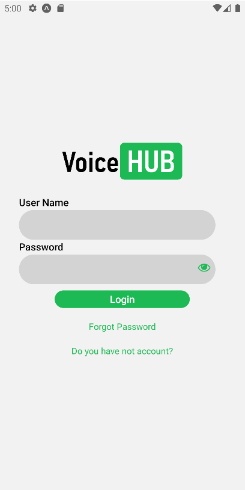
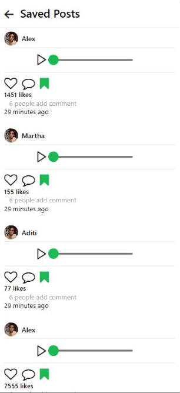

# VoiceHub-Mobile
I am building a social media platform for audio sharing with Node.js, React.js and SQL database. Users can upload, share and comment on audio files. Designed for easy use and audio playback security.

